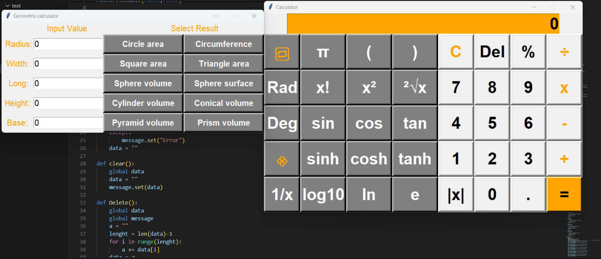

# 🧮 Python Scientific & Geometry Calculator

A GUI-based calculator developed with **Python Tkinter**.  
It supports basic arithmetic, scientific calculations, and geometry calculations.

---

## System Functions

### Basic Calculations
- Addition `+`
- Subtraction `-`
- Multiplication `×`
- Division `÷`
- Percentage `%`
- Absolute value `|x|`
- Delete one character `Del`
- Clear all values `C`
- Parentheses `( )`

### Scientific Calculations
- `sin`, `cos`, `tan`
- `sin⁻¹`, `cos⁻¹`, `tan⁻¹`
- `sinh`, `cosh`, `tanh`
- `sinh⁻¹`, `cosh⁻¹`, `tanh⁻¹`
- `log10`, `log2`, `ln`
- `x²`, `x³`
- `√x`, `∛x`
- `1/x`
- `x!`
- `eˣ`
- `π`, `2π`, `e`
- Degree ↔ Radian conversion
- Random number generation

### Geometry Calculations
- Circle area
- Circumference
- Rectangle area
- Triangle area
- Sphere volume
- Sphere surface area
- Cylinder volume
- Cone volume
- Pyramid volume
- Prism volume

---

## How to Use

1. Run the program using `PCAL-Code.py`.
2. Select the numbers and mathematical operators you want to calculate.
3. Press `=` to display the result.
4. Use `C` to clear all input values.
5. Use `Del` to delete one character at a time.
6. Press `🔁` to switch between scientific function modes.
7. Press `💠` to open the **Geometry Calculator**.
8. Enter values such as Radius, Width, Length, Height, or Base, then select the geometry calculation you want to perform.

---

## Application Preview

---
